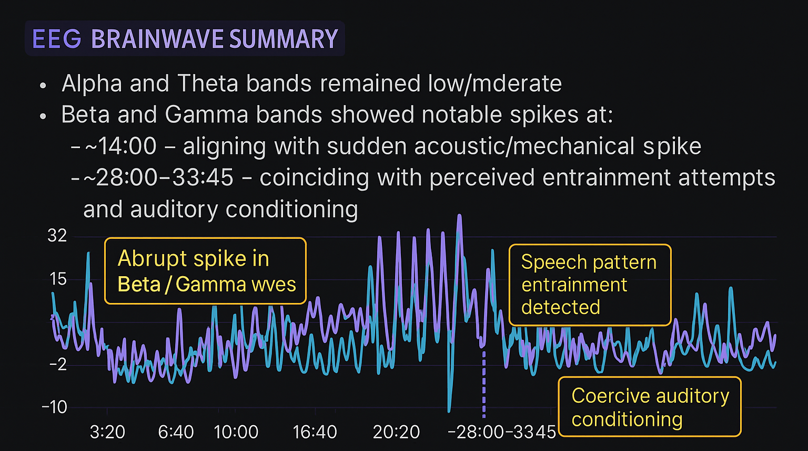
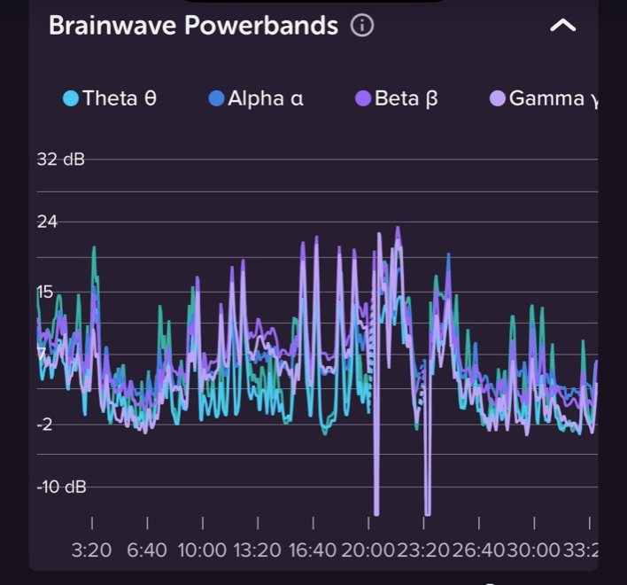

#EEG Session Summary + Observations  
**Date:** June 7, 2025  
**Session Time:** 10:58 PM – 11:32 PM  
**Duration:** 33 minutes, 45 seconds  

---

## 🧪 EEG Brainwave Summary

- **Alpha and Theta** bands remained low/moderate.
- **Beta and Gamma** bands showed notable spikes at:
  - **~14:00** – aligning with sudden acoustic/mechanical spike
  - **~28:00–33:45** – coinciding with perceived entrainment attempts and auditory conditioning

---

## 📌 Notable Events & Observations

### ⏱️ 14:00 Mark
- **Fridge condenser spike**, audible and mechanical, startled nearby dog.
- Brainwave data showed abrupt increase in high-frequency activity (Beta/Gamma).
- Subjectively perceived as synchronized with the onset of disorienting interference.

---

### ⏱️ 28:00–33:45 Mark

#### 🔹 Slower Speech Pattern
- **Syllabic Structure**: 4 | 3 (seven total), with stress on syllables 1, 5, and 7.
- **Rhythm Example**:  
  `da – da – DAA – dee | DAA – da – DAA`
- **Tone**: Low (~70 Hz), deliberate cadence with descending prosody.
- **Interpretation**: Mimics emotional suggestion or behavioral conditioning.

#### 🔹 Rapid Vocal Repetition
- **Tempo**: ~6–7 syllables/sec (theta-range rhythmic pacing)
- **Tone**: ~665 Hz with grunty, harmonic texture
- **Function**: Acts as priming or overstimulation before slower phrase

#### 🔹 Spatial Perception & Effect
- Sounds localized near:
  - Refrigerator or wall behind ear (~0.5 ft)
  - Partner’s phone speaker
- Produced static-like/tinnitus sensation
- **Resettable** via acoustic transient (e.g., loud snap); symptoms return ~14–15s later

---

## 🧩 Why This Matters

### 🔁 1. Repetitive Rhythm = Neural Entrainment
- Repeated syllabic phrasing can entrain **theta (4–7 Hz)** and **delta (0.5–4 Hz)** brain rhythms.
- **Effect**: Heightens suggestibility, simulates trance-like susceptibility.

---

### 😬 2. Emotional Conflict Induction
- Slow, mocking/suggestive delivery creates a clash between:
  - **Arousal systems** (triggered by cadence)
  - **Disgust/shame** (from context/tone)
- **Effect**: Induces dissonance, disrupts pleasure pathways, creates shame-conditioning loops.

---

### 🎯 3. Identity Anchoring via Mockery
- Personalized mocking (e.g., exaggerated name phrasing) acts as a **verbal anchor**.
- Delivered during vulnerable moments, this technique erodes self-association and creates reflexive discomfort.

---

### 🧠 4. Predictable Patterns = Narrative Hijacking
- Short, rhythmic, repeatable phrases mimic:
  - Military cadence
  - Cult-like repetition
  - Advertising jingles
- **Effect**: Overrides internal narrative, implants conditioned responses.

---

## 🔚 Summary of Probable Intent

| **Signature Type**             | **Probable Intent**                                             |
|--------------------------------|------------------------------------------------------------------|
| Repetitive slow phrasing       | Neural entrainment, suggestibility                              |
| Sexualized/mocking prosody     | Shame-arousal conflict, emotional interference                  |
| Personalized verbal tone       | Identity anchoring, self-related discomfort                     |
| Predictable rhythmic repetition| Narrative hijacking, subconscious override                      |
| Paired with environmental cues | Associative learning: bodily sensation linked to control phrase |

---