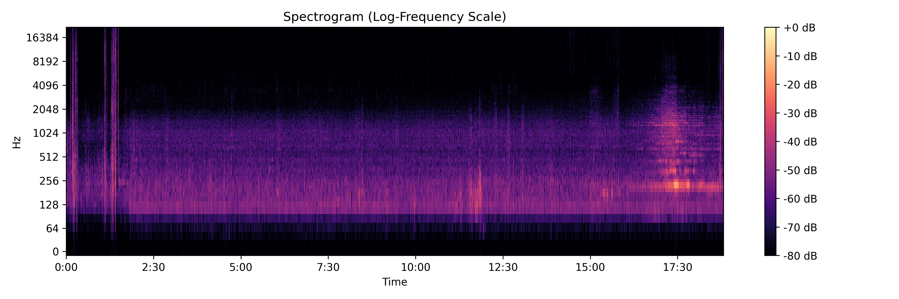
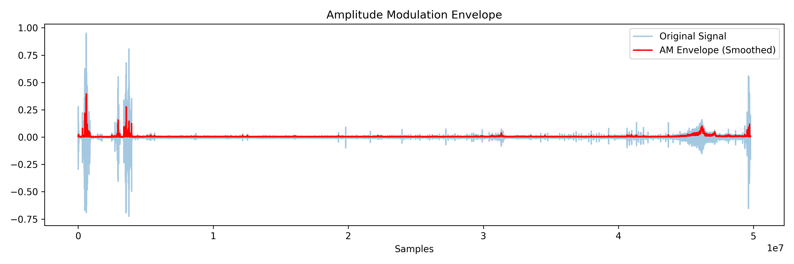
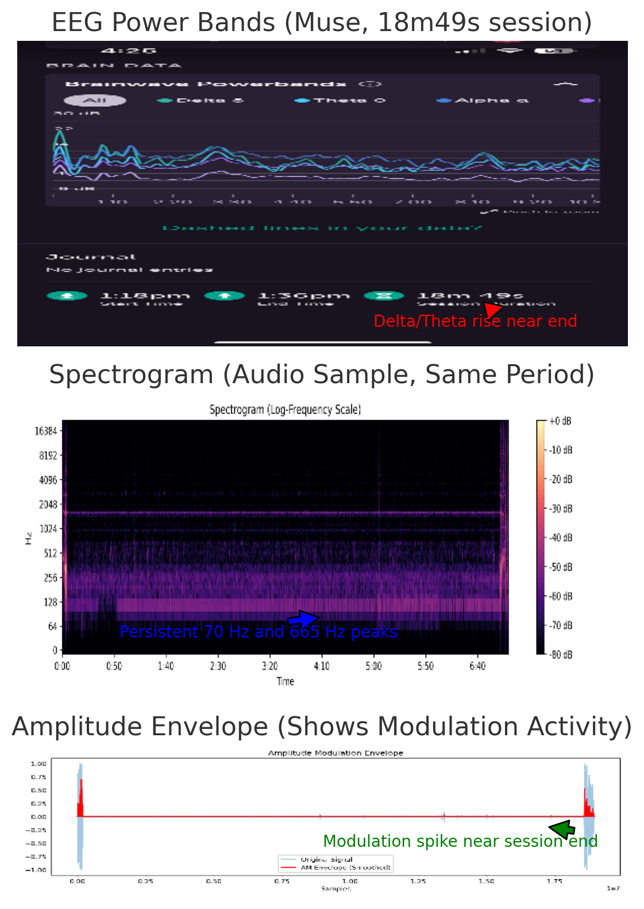

## EEG and Audio Signal Comparison – 18m49s Session

This analysis compares **EEG brainwave activity** (captured using a Muse headband) with **acoustic signal data** from an 18-minute recording session in a residential environment with typical ambient noise levels.

---

### 🧠 EEG Overview

- Device: Muse
- Duration: 18 minutes, 49 seconds
- Activity: Seated, resting
- Observations:
  - Noticeable **rise in Delta and Theta** bands near session end
  - May indicate **drowsiness**, **entrainment**, or external modulation effects

📈 EEG Graph:

> 🔴 *Delta/Theta surge begins around 16:30 mark*

---

### 🔊 Audio Signal Analysis

The following plots represent an audio recording taken during the same timeframe.

---

#### 🎛 Spectrogram

- Highlights sustained tones at:
  - **~70 Hz** — often near appliance hum, but unusually clean and steady
  - **~665 Hz** — highly unusual for background environments
- Suggests **synthetic or modulated signal** rather than organic ambient noise

📊 Spectrogram:

> 🔵 *Persistent peaks at ~70 Hz and ~665 Hz visible throughout session*

---

#### 📉 Amplitude Envelope

- Captures loudness/modulation over time
- Relatively flat mid-session, followed by a **sharp increase in modulation activity** near the end
- Correlates with EEG shift into Delta/Theta

📈 Envelope Plot:

> 🟢 *Modulation spike aligns with EEG low-frequency surge*

---

### 🔗 Interpretation

- **Temporal correlation** between audio amplitude modulation and EEG brainwave shifts
- **Unusual tonal persistence** at frequencies not commonly found in natural indoor environments
- Suggests possibility of:
  - External signal presence
  - Neurological entrainment attempt
  - Environmental interference with neurophysiological patterns

---

