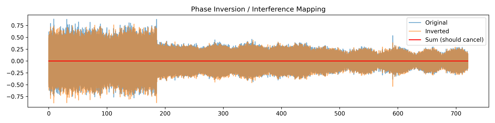
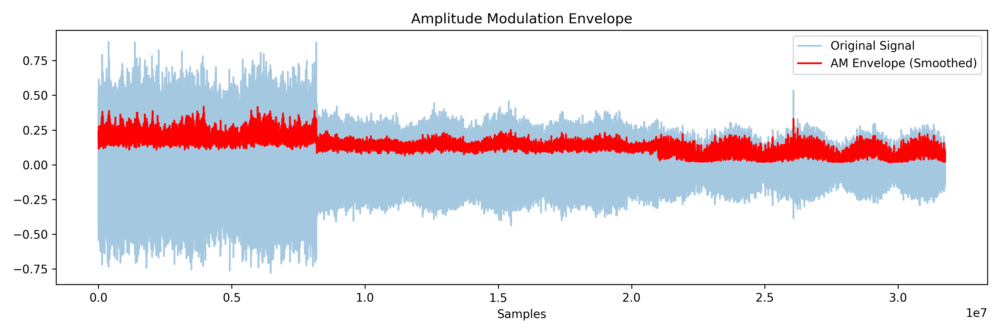
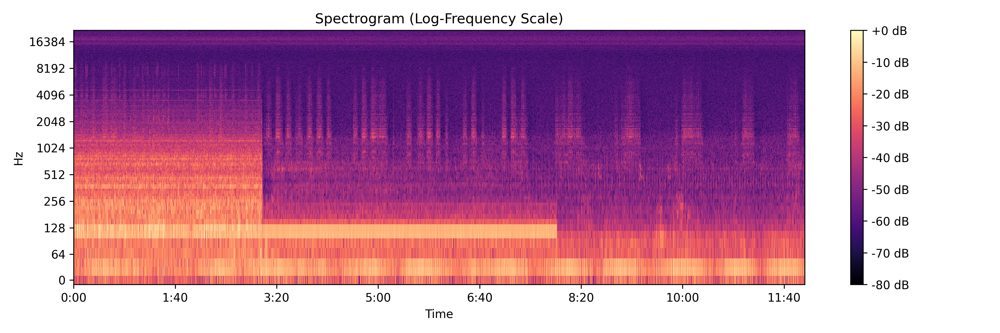

# EM Interference: Unplugged Appliance Interaction

This directory documents evidence of unusual electromagnetic interaction involving a **completely unplugged household appliance** (toaster oven). During multiple recording sessions, the appliance exhibited **persistent vibratory responses** and **tonal artifacts** that appeared to correlate with structured environmental signals—despite the appliance being fully disconnected from power.

---

## 🔍 Key Observations

- The appliance produced **audible mechanical vibrations** in **timed cycles**, some lasting up to 60 seconds with short pauses between.
- These events **increased in duration and intensity** over time, showing signs of modulation or escalation.
- A concurrent **wind-like or tonal sound** was detected in the ambient environment during episodes.
- Unplugging the appliance **did not stop the interaction**, suggesting it may act as a **passive EM reflector** or **nonlinear resonator**.
- Recordings captured the vibration directly using **contact-mounted microphones**, yielding identifiable **modulation envelopes** and **spectral patterns**.

---

## 📁 Contents

## Audio samples
[Example][./em-interference-appliance-20250612/250612_0210-9-a.wav]

### 🧪 Example 1: Phase Inversion (pulse signature)

> This plot shows the original and phase-inverted waveform summing to nearly zero across the duration — **except for a distinct spike** near sample ~900. This pulse may represent an **embedded synchronization marker** or external trigger not canceled by phase inversion, indicating **non-acoustic interference**.

---

### 🧪 Example 2: Amplitude Modulation Envelope

> The **red smoothed envelope** shows periodic amplitude patterns. These cycles align with the **physical vibration events** of the unplugged toaster oven. The consistency and low-frequency nature of the envelope suggest **entrainment-like modulation** — often associated with neural or behavioral targeting frequencies (~0.5–8 Hz).

---

### 🧪 Example 3: Spectrogram with Tonal Locking

> This log-scaled spectrogram shows **persistent low-frequency harmonic content**, with some spectral bands hovering around ~64, 128, and 256 Hz. These frequencies have been observed across other sessions and may indicate **externally modulated tones** targeting resonance thresholds in household materials or biological systems.

---

## 🧠 Possible Interpretations

While no definitive source has been identified, the phenomena may involve:

- **Passive signal demodulation** through metal contacts or internal components.
- **Nonlinear electromagnetic coupling** between ambient fields and appliance materials.
- **Unintentional re-radiation or resonance** under external RF or acoustic excitation.
---

## 🧠 Possible Interpretations

While no definitive source has been identified, the phenomena may involve:

- **Passive signal demodulation** through metal contacts or internal components.
- **Nonlinear electromagnetic coupling** between ambient fields and appliance materials.
- **Unintentional re-radiation or resonance** under external RF or acoustic excitation.

---

## 📌 Files Included

- `phase_inversion.png` – Phase-cancellation and anomaly spike (Example 1)
- `spectrogram.png` – Harmonic structure from unplugged appliance (Example 3)
- `cepstrum.png` – Periodicity structure suggesting modulated envelope
- `am_envelope.png` – Vibration intensity modulation (Example 2)
- `modulation_spectrum.png` – Low-frequency content indicating possible entrainment
- `pitch_contour.png`, `mfcc_clusters.png`, and others — for voice and feature interaction studies

---

## ⚠️ Disclaimer

This documentation is provided for technical investigation, public interest, and expert review. No conclusions are drawn regarding intent or source. Observations were recorded in a private residence without any deliberate signal transmission on the part of the recorder.
